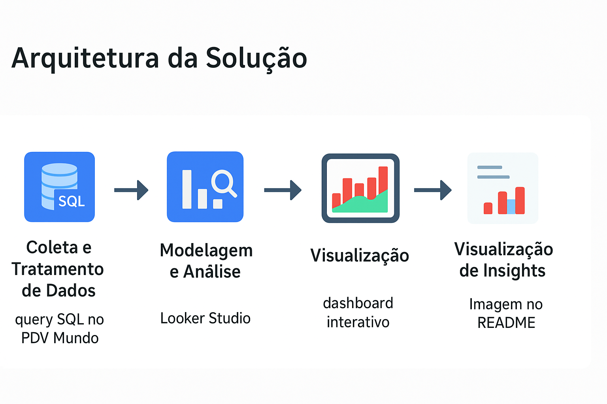

# 📈 Análise Inteligente de Vendas do PDV Mundo

Este projeto apresenta uma solução completa de análise de dados para identificar oportunidades de aumento de vendas no portfólio, utilizando automação de dados e dashboards interativos no Looker Studio.

---

## 🚀 Objetivo

Extrair insights valiosos a partir dos dados de vendas do **App PDV Mundo**, automatizando as etapas de:
- Coleta e tratamento de dados via query SQL.
- Modelagem e análise focada em oportunidades de negócio.
- Visualização em dashboard interativo (Looker Studio) para a tomada de decisões.

---

## 📐 Arquitetura da Solução



A solução é baseada em três etapas principais:
1. **Coleta e Tratamento de Dados:** Uma query SQL (salva em [`analise/query_tratamento_pdv.sql`](analise/query_tratamento_pdv.sql)) extrai e pré-processa os dados do PDV Mundo.
2. **Modelagem e Análise:** O [Looker Studio](https://lookerstudio.google.com/) é usado para criar métricas e filtros que revelam oportunidades de aumento de vendas.
3. **Visualização:** O dashboard no Looker Studio apresenta os insights de forma clara, ajudando a identificar o desempenho por produto, região e período.

---

## 🗂️ Estrutura do Projeto

```plaintext
projeto-vendas-pdv/
├── analise/
│   └── query_tratamento_pdv.sql      # Query SQL para tratamento de dados.
├── dashboard/
│   └── dashboard_looker.pdf          # PDF do dashboard do Looker Studio.
├── imagens/
│   └── arquitetura_solucao.png       # Imagem da arquitetura da solução.
├── .gitignore                        # Arquivos ignorados pelo Git.
└── README.md                         # Este documento.

📊 Etapas Concluídas
1️⃣ Coleta e Transformação dos Dados

Fonte: App PDV Mundo
Processo: Uma query SQL, que pode ser encontrada na pasta analise, automatiza a extração e o pré-processamento, garantindo que os dados estejam prontos para a análise.
Output: Os dados processados são carregados diretamente no Looker Studio para visualização.

2️⃣ Análise e Modelagem

Foco: Criação de métricas, gráficos e filtros no Looker Studio para identificar padrões de vendas e oportunidades de portfólio.
Insights: O dashboard permite explorar o desempenho de vendas por produto, região e período para sugerir ações comerciais estratégicas.

3️⃣ Dashboard de Oportunidades no Looker Studio

O dashboard interativo está disponível para visualização no link abaixo:
🔗 Dashboard de Oportunidades - Looker Studio

Principais visualizações:

📊 Performance de vendas por item do portfólio.

🌍 Distribuição de vendas por região.

📈 Tendências de vendas ao longo do tempo.

👨‍💻 Autor

Diogo Crelier
